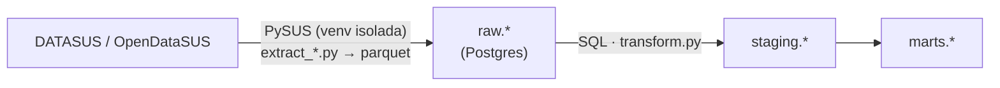

# Pipeline de Dengue — RJ

Pipeline de dados em **Airflow + Postgres + Docker** que cruza notificações de dengue
(SINAN), internações hospitalares por dengue (SIH-RD) e população (IBGE) do Rio de
Janeiro, produzindo um indicador mensal por município: **quantas notificações viraram
internação, por 100 mil habitantes**.

## Pergunta de negócio

Com a temporada de dengue se aproximando (pico no Brasil entre dez-abr), interessa saber
onde a vigilância está notificando muito mas a rede hospitalar está sentindo pouco (ou o
contrário) — um sinal de subnotificação, de gravidade localizada, ou só de diferença no
tamanho da epidemia por município.

## Fontes

| Fonte | O que é | Granularidade | Via |
|---|---|---|---|
| SINAN | Notificações de dengue | 1 linha por notificação, residência | OpenDataSUS (PySUS) |
| SIH-RD | Internações por dengue (CID A90/A91) | 1 linha por internação, mês | PySUS (espelho S3) |
| IBGE/POPT | População estimada por município | 1 linha por município/ano | PySUS (espelho S3 + FTP) |

Escopo: UF = RJ, SINAN 2024, SIH 2024 (11 de 12 meses — ver lacuna abaixo), população
2020-2025.

## Arquitetura



Tudo orquestrado por 4 DAGs no Airflow (`dag_sinan_dengue`, `dag_sih_dengue`,
`dag_populacao_ibge`, `dag_marts_dengue`), rodando em Docker Compose (Postgres 16 +
Airflow 3.3.2, `LocalExecutor`).

### Por que uma imagem Docker customizada

O PySUS fixa versões de `pandas`/`typer`/`python-dateutil` incompatíveis com as que o
Airflow 3.3.2 usa internamente — instalá-lo junto quebraria o próprio Airflow. A imagem
roda dois Pythons: o ambiente principal do Airflow, e uma venv isolada
(`/opt/pysus-venv`) só para o PySUS. As tasks que baixam dado (`extract_*`) rodam na venv
isolada via `ExternalPythonOperator`; as que gravam no Postgres (`carregar_*`, e toda a
etapa de staging/marts) rodam no ambiente principal. Detalhes em [`CLAUDE.md`](CLAUDE.md).

## Decisões de qualidade de dado

- **SINAN sem ID único**: o CSV público não traz `NU_NOTIFIC`. Chave sintética (hash
  SHA1 de campos que a vigilância não revisa depois) garante carga idempotente.
- **5 linhas de município inválido no SINAN** (3 de outra UF, 1 nula, 1 com código
  `330000`) — excluídas na staging, não escondidas: ficam documentadas como achado.
- **Lacuna conhecida: SIH-RD RJ 2024-07** não existe no catálogo do PySUS (embora exista
  no FTP bruto do DATASUS). A DAG trata esse mês como `skipped`, não `failed` — o
  pipeline não quebra por um mês faltante, só registra o buraco.
- **SIH é por estabelecimento, não por residência**: 47 internações de 2024 eram de
  pacientes residentes fora do RJ, atendidos lá. Como a pergunta de negócio é sobre
  incidência por residência (comparável ao SINAN), essas linhas foram filtradas na
  staging — ficam preservadas em `raw.sih_dengue`, caso a pergunta mude.

## Resultado

`marts.fato_dengue_mensal_municipio`: 986 linhas (município × ano-mês, dez/2023 a
dez/2024), com notificações, internações, população e as duas taxas calculadas.

## Como rodar

```bash
cp .env.example .env            # trocar POSTGRES_PASSWORD
docker compose build
docker compose up airflow-init  # migração do metadata DB do Airflow
docker compose up -d
```

UI do Airflow: http://localhost:8080 (usuário `airflow`; senha gerada, ver
`docker compose logs airflow-api-server | grep -i password`).

Ordem das DAGs (todas com `schedule=None`, disparo manual):
`dag_sinan_dengue`, `dag_sih_dengue`, `dag_populacao_ibge` → depois `dag_marts_dengue`
(aplicar antes `sql/001`, `sql/002`, `sql/003` no Postgres).

Comandos completos e troubleshooting: [`CLAUDE.md`](CLAUDE.md).

## Stack

Python · Apache Airflow 3.3.2 · PostgreSQL 16 · Docker Compose · PySUS

---

Projeto de portfólio, construído com apoio do Claude Code. Autora com 11+ anos de
experiência em sistemas de saúde pública (SUS), aprofundando conceitos de Engenharia de
Dados.
